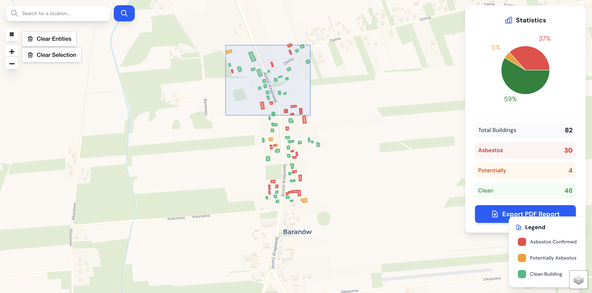
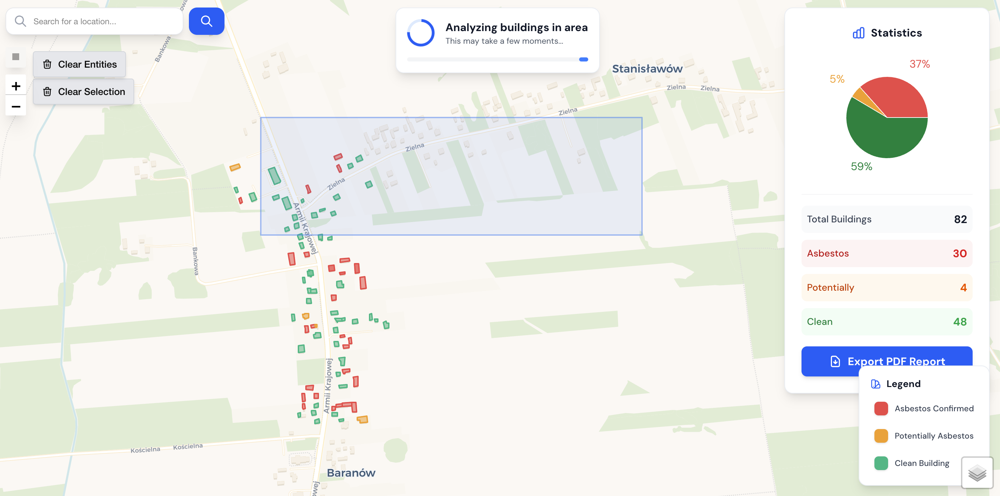
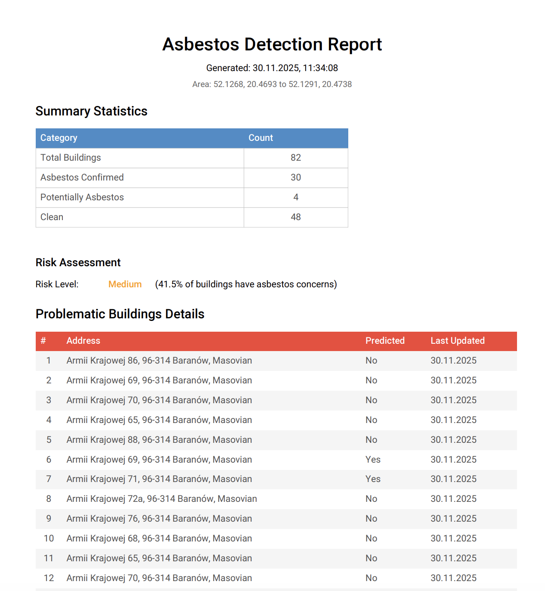

# 🏗️ System Detekcji Azbestu - Dokumentacja Projektu

## Zdjęcia







## 📋 Opis Rozwiązania

**Aplikacja webowa wspierająca urzędników w identyfikacji budynków z dachami azbestowymi** poprzez inteligentne połączenie oficjalnej bazy azbestowej z predykcją opartą o uczenie maszynowe.

### Problem
Brak narzędzi do efektywnego mapowania budynków z azbestem na dużych obszarach. Ręczna analiza jest czasochłonna i nieefektywna dla całych gmin.

### Rozwiązanie
Interaktywna mapa pozwalająca na automatyczne skanowanie obszarów z:
- Weryfikacją w oficjalnej bazie azbestowej (gov.pl)
- Predykcją ML dla budynków nieznanych
- Wizualizacją kolorystyczną (czerwony=azbest, pomarańczowy=potrncjalny azbest przez ML, zielony=czysty)
- Statystykami i exportem do PDF

---

## 🏛️ Architektura Systemu

### Architektura High-Level

```
┌─────────────────┐                          ┌──────────────────┐
│   Frontend      │     REST API (JSON)      │   Backend        │
│   Next.js 16    │ ◄──────────────────────► │   Express.js     │
│   (React)       │      HTTP/HTTPS          │   (Node.js)      │
└─────────────────┘                          └──────────────────┘
      │                                             │
      │                             ┌───────────────┼────────────────┐
      │                             │               │                │
      ▼                       ┌─────▼─────┐  ┌──────▼──────┐  ┌─────▼──────┐
┌─────────────┐               │   MySQL   │  │  Python ML  │  │  External  │
│   Mapbox    │               │ Database  │  │   Service   │  │    APIs    │
│  (Tiles)    │               │ (Prisma)  │  │   (ONNX)    │  │            │
└─────────────┘               └───────────┘  └─────────────┘  └────────────┘
                                                                     │
                                                      ┌──────────────┼──────────┐
                                                      │              │          │
                                                 Overpass API   Baza Azbestowa  Mapbox
                                                 (budynki OSM)  (WMS GeoServer) (geocoding)
```

### Monorepo (pnpm workspaces)
```
packages/
├── database/       # Prisma schema + MySQL client (source of truth typów)
├── validation/     # Zod schemas (HTTP request/response validation)
├── backend/        # Express API + business logic
└── frontend/       # Next.js App Router + Leaflet map
```

---

## 🔧 Wykorzystane Technologie i Zasoby

### Stack Technologiczny

| Warstwa | Technologia | Wersja | Uzasadnienie |
|---------|-------------|--------|--------------|
| **Backend Runtime** | Node.js | 20 LTS | Stabilna, long-term support |
| **Backend Framework** | Express.js | 4.18 | Minimalistyczny, szybki setup |
| **Database** | MySQL | 8.0 | Relacyjna + spatial indexes |
| **ORM** | Prisma | 5.x | Type-safe queries, migracje |
| **Validation** | Zod | 3.22 | Runtime + compile-time safety |
| **Frontend Framework** | Next.js | 16 | App Router, RSC, SSR |
| **State Management** | React Query | 5.x | Cache, optimistic updates |
| **Map Engine** | Leaflet | 1.9 | Open-source, lightweight |
| **Styling** | Tailwind CSS | 4.x | Utility-first, rapid dev |
| **ML Runtime** | Python FastAPI + ONNX | - | Szybki inference modeli ML |

### Zasoby Zewnętrzne

#### 1. **OpenStreetMap Overpass API**
**Endpoint:** `https://overpass-api.de/api/interpreter`
**Cel:** Pobieranie geometrii budynków (polygon coordinates)
**Integracja:**
- Zapytanie o budynki w danym obszarze (bounding box)
- Format danych: JSON (GeoJSON-compatible)
- Optymalizacja: Caching w bazie MySQL (unikanie powtórnych zapytań)

#### 2. **Baza Azbestowa (GeoServer WMS)**
**Endpoint:** `https://esip.bazaazbestowa.gov.pl/GeoServerProxy`
**Cel:** Weryfikacja czy budynek znajduje się w oficjalnej bazie azbestowej
**Metoda:** Web Map Service (WMS)
**Integracja:**
- Pobieranie warstwy WMS dla obszaru budynku
- Analiza pikseli charakterystycznego koloru azbestu (zielony #2c8900 ± tolerancja)
- Sprawdzenie czy piksele azbestu znajdują się wewnątrz geometrii budynku (point-in-polygon)
- Wynik: Potwierdzenie lub brak azbestu

#### 3. **Mapbox Geocoding API**
**Endpoint:** `https://api.mapbox.com/geocoding/v5/`
**Cel:**
- Forward geocoding (adres → współrzędne)
- Batch reverse geocoding (współrzędne → adresy)

**Możliwości:**
- Wyszukiwanie miejsc po nazwie
- Reverse geocoding (współrzędne → adres)
- Batch API (do 1000 lokalizacji naraz)

**Wykorzystanie:**
- Wyszukiwarka adresów w interfejsie użytkownika
- Automatyczne pobieranie adresów dla wykrytych budynków

#### 4. **Python ML Service (Custom)**
**Port:** `8000` (FastAPI)
**Model:** ONNX Runtime (asbestos_net.onnx)
**Endpoint:** `POST /predict`
**Input:** Współrzędne polygonu budynku
**Output:** Predykcja czy budynek potencjalnie zawiera azbest (true/false/null)
**Timeout:** 5s (fallback do null przy błędzie)

---

## 💾 Model Danych

### Struktura Bazy Danych (Building)

**Główne pola:**
- **ID:** Unikalny identyfikator (CUID)
- **Geometria:** Polygon (współrzędne GeoJSON) + centroid (lng, lat)
- **Status azbestu:**
  - `isAsbestos` - z oficjalnej bazy
  - `isPotentiallyAsbestos` - predykcja ML (może być null)
- **Metadane:** createdAt, updatedAt

**Optymalizacje:**
- **Spatial indexes** na centroid → szybkie bbox queries (<100ms)
- **Deduplikacja** budynków (tolerance 0.0001° = ~11m)
- **Connection pooling** (10 connections)
- **Prepared statements** (Prisma ORM)

---

## 🔄 Przepływ Danych (User Flow)

### Scenariusz: Użytkownik skanuje obszar na mapie

```
1. USER: Zaznacza prostokąt na mapie (leaflet-draw)
           ↓
2. FRONTEND: POST /api/bbox { ne: {lat,lng}, sw: {lat,lng} }
           ↓
3. BACKEND: Sprawdza cache w MySQL
   ├─ Budynek istnieje → zwróć z bazy (FAST PATH)
   └─ Budynek nowy → wykonaj kroki 4-6 (SLOW PATH)
           ↓
4. OVERPASS API: Pobierz geometrie budynków w bbox
   - Request: Overpass QL query
   - Response: Array of building polygons
           ↓
5. BAZA AZBESTOWA: Dla każdego budynku
   - Fetch WMS tile dla bbox budynku
   - Analiza pikseli (#2c8900)
   - Point-in-polygon → isAsbestos: boolean
           ↓
6. ML SERVICE: Dla budynków bez azbestu
   - POST /predict z polygon
   - Response: isPotentiallyAsbestos: boolean | null
   - Timeout: 5s → null
           ↓
7. SAVE TO MYSQL: Zapisz wszystkie budynki
           ↓
8. RESPONSE: Zwróć { buildings[], stats }
           ↓
9. FRONTEND: Renderuj
   - Budynki na mapie (kolorowane wg statusu)
   - Panel statystyk (total, azbest, potencjalny, czysty)
   - Export PDF (jsPDF + autoTable)
```

**Performance:**
- Cache hit: **<100ms**
- New area (50 buildings): **5-10s**
- ML prediction: **<5s** (z timeoutem)

---

## 🎯 Kluczowe Funkcjonalności

### 1. Interaktywna Mapa (Leaflet)
- **Rectangle drawing:** Zaznaczanie obszarów do skanowania
- **Validation:** Max ~2km × 2km (0.01 deg² bbox area)
- **Color coding:**
  - 🔴 **Czerwony:** Potwierdzony azbest (oficjalna baza)
  - 🟠 **Pomarańczowy:** Podejrzany azbest (predykcja ML)
  - 🟢 **Zielony:** Czysty budynek
  - ⚪ **Szary:** Nieznany status (ML nie sprawdził)
- **Popups:** Szczegóły budynku (status, adres, ID)

### 2. Panel Statystyk
- **Liczniki:** Total / Azbest / Potencjalny / Czysty / Nieznany
- **Wykres kołowy:** Recharts visualization
- **Export PDF:** jsPDF + autoTable (raport z statystykami)

### 3. Wyszukiwanie Adresów
- **Forward geocoding:** Wpisz adres → przenieś mapę
- **Batch reverse:** Automatyczne adresy dla budynków
- **Debounced search:** 500ms delay

### 4. Optymalizacje UX
- **React Query cache:** 60s (minimalizacja API calls)
- **Optimistic updates:** UI update przed API response
- **Loading states:** Szkielety, spinnery
- **Error handling:** Toast notifications (react-hot-toast)

---

## 🚀 Deployment & Infrastructure

### Konteneryzacja (Docker Compose)

Aplikacja jest w pełni skonteneryzowana z wykorzystaniem Docker Compose:
- **Backend:** Express.js API (port 3030)
- **Frontend:** Next.js aplikacja (port 3031)
- **ML Service:** Python FastAPI z ONNX (port 3032)

**Dostępne serwisy po wdrożeniu:**
- Backend API (port 3030)
- Frontend aplikacja (port 3031)
- ML Service (port 3032)

---

## 📊 Metryki Projektu

### Performance
- **Cache hit query:** <100ms
- **New area scan (50 bldg):** 5-10s
- **ML inference:** <5s (per building)
- **Database connections:** 10 (pool)
- **Docker build time:** ~3 min (full)

---

## 💡 Innowacje i Wartość

### Kluczowe innowacje
1. **🧠 Hybrid Detection:** Oficjalna baza + ML = maksymalne pokrycie
2. **🚀 Smart Caching:** MySQL → zero duplikatów API calls
3. **🎨 Visual Clarity:** Kolorystyka (czerwony/pomarańczowy/zielony)
4. **📦 Monorepo + Type Safety:** Shared types → brak desynchronizacji
5. **🔗 Contract-First API:** OpenAPI → auto-generated client

### Wartość dla użytkownika końcowego
- **Automatyzacja:** Zamiast ręcznej analizy map
- **Szybkość:** Skanowanie 50 budynków w ~10s
- **Dokładność:** Oficjalna baza + ML validation
- **Raportowanie:** Export PDF dla urzędów
- **Skalowalność:** Cache → kolejne skanowania tego samego obszaru <100ms